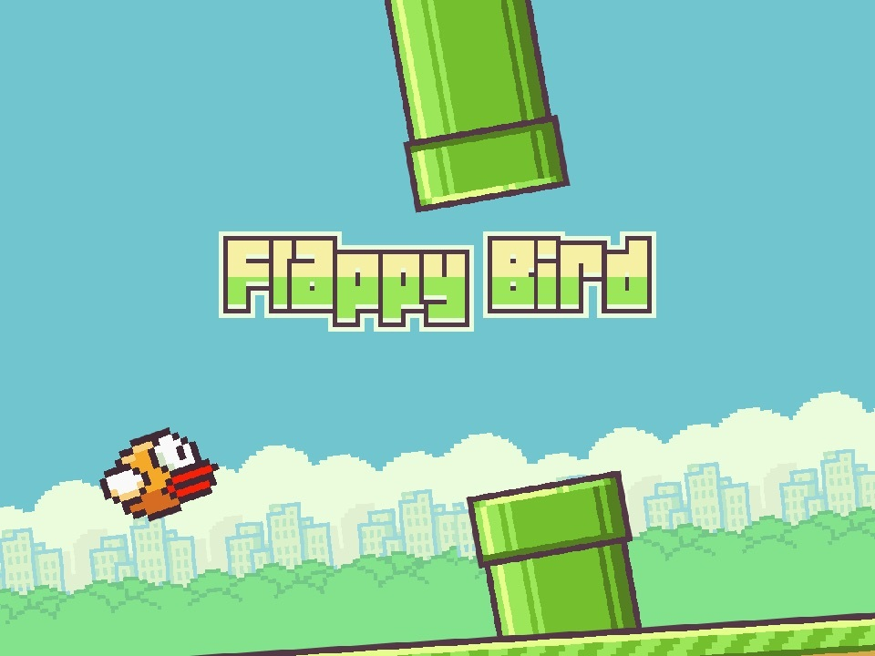

# FlappyBird
RL algorithm that plays the game inspired by the **Flappy Bird**

## Flappy Bird

**Flappy Bird** is an arcade styled game, where players control a bird called *Faby*. Players navigate Faby to avoid pipelines and get points.

  

## Installation & usage
...

## Reinforcement learning
...

## Libraries
...

## PK3 requirements
...

## Textures
Textures have been generated by LLMs or downloaded from <a href="https://www.spriters-resource.com/mobile/flappybird/asset/59894/">here</a>.

## License
This project is licensed under the MIT License. See the LICENSE file for details.
